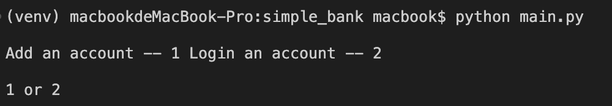
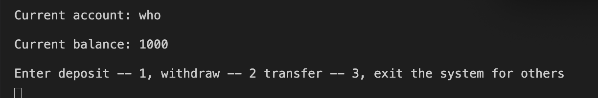

## 🏦Simple Banking System
## 💾Document
``` python3
SIMPLE_BANK
├── main.py -- Program entrance
├── test_main.py -- Program test
├── requirements.txt -- Third party dependencies
├── record.csv -- CSV file records system state

```
## How to run
#### 1. Insatll requirements
``` python3
pip install -r requirements
```
#### 2. run
``` python3
python main.py
```
#### 3. Create or Login

#### 4. deposit, withdraw or transfer
